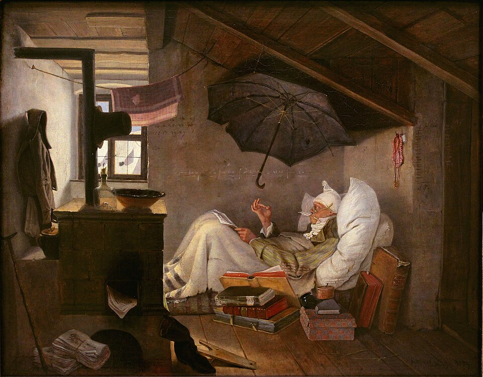

# pedrodelfino.com



*"The Poor Poet" (1839) by Carl Spitzweg — [Wikipedia](https://en.wikipedia.org/wiki/The_Poor_Poet)*

A personal blog built entirely with Emacs Org-mode -- because writing HTML by hand was too easy.

**Live at [pedrodelfino.com](https://pedrodelfino.com)**

## About

This is the source for my English-language personal blog. Posts are authored as `.org` files and compiled to static HTML using Emacs `org-publish`. The site covers a mix of topics: technical articles (including contributions to the [Nyxt Browser](https://nyxt.atlas.engineer/) project), creative writing, productivity, cooking, and more.

The visual style is a hand-crafted CSS theme inspired by the `doom-one-light` Emacs color scheme, with Inter for body text and JetBrains Mono for code -- because matching hex codes from my editor felt like the right thing to do.

## Tech Stack

- **Markup**: Emacs Org-mode
- **CSS**: Custom stylesheet inspired by doom-one-light
- **Build**: Elisp (`build-site.el`) + Makefile
- **Hosting**: AWS S3 + CloudFront CDN
- **CI/CD**: GitHub Actions (deploy, build check, spell check, lint)
- **Newsletter**: Buttondown
- **Contact form**: Formspree

## Usage

```bash
make build   # build the site into ./public/
make serve   # build + open browser at localhost:8000
make clean   # remove ./public/
```

Requires Emacs with `org-mode`. The build script (`build-site.el`) automatically installs the `htmlize` package for syntax highlighting.

## Project Structure

```
.
├── build-site.el        # org-publish configuration (Elisp)
├── build.sh             # shell wrapper for the build
├── Makefile             # build / serve / clean targets
├── index.org            # homepage
├── posts/               # blog posts (.org files)
├── drafts/              # unpublished drafts (excluded from build)
├── style.css            # doom-one-light inspired theme
├── img/                 # images and favicon
├── cspell.json          # spell checker config
└── .github/workflows/   # CI: deploy, build check, spell check, lint
```

## Author

Pedro Delfino -- [GitHub](https://github.com/pdelfino) -- [pdelfino.com.br](https://www.pdelfino.com.br) (Portuguese blog)
